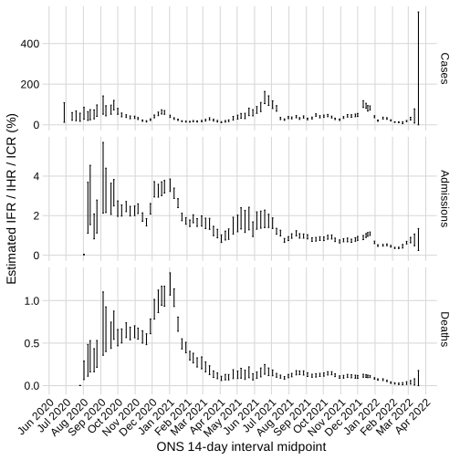

# Estimates of COVID-19 reporting and severity

This uses estimates of infection incidence from the [EpiForecasts Rt pipeline](https://github.com/epiforecasts/covid-rt-estimates) combined with [PCR positivity curves](https://bmcmedicine.biomedcentral.com/articles/10.1186/s12916-021-01982-x) and estimates of positivity prevalence from the [ONS Community Infection Survey](https://www.ons.gov.uk/peoplepopulationandcommunity/healthandsocialcare/conditionsanddiseases/bulletins/coronaviruscovid19infectionsurveypilot/previousReleases) to estimates changes over time in: reporting rate of infections, infection-hospitalisation ratio, and infection-fatality ratio. A version of this plot appears in the supplementary material of Vöhringer et al's [Genomic reconstruction of the SARS-CoV-2 epidemic in England](https://www.nature.com/articles/s41586-021-04069-y).

The estimates of infection incidence rely on estimates of delay distributions from infections to cases, infections to hospitalisations, and infections to deaths. These are difficult to ascertain over time and thus almost certainly incorrect, which biases these estimates. We advise that the trends displayed are therefore interpreted with caution.

